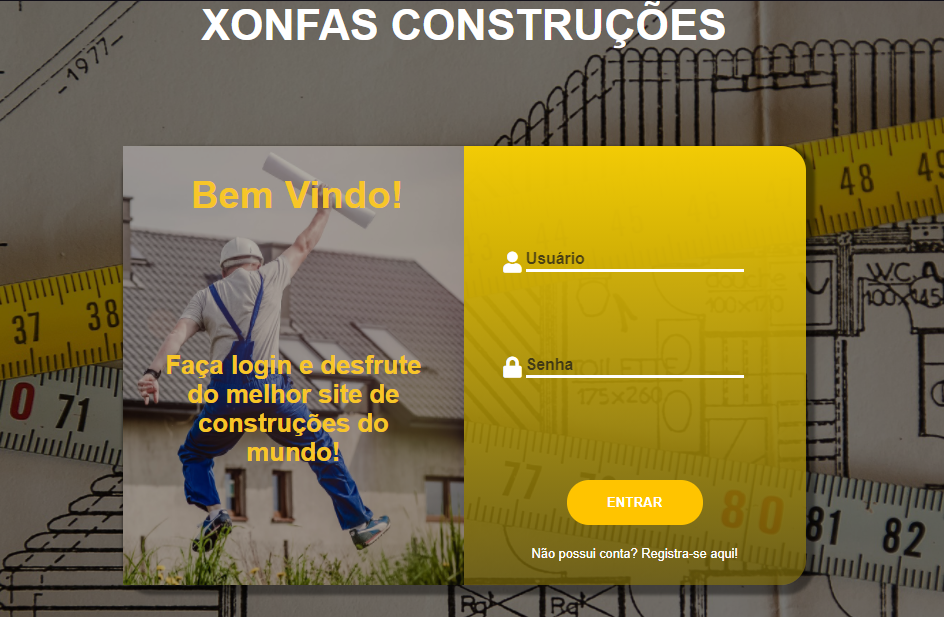
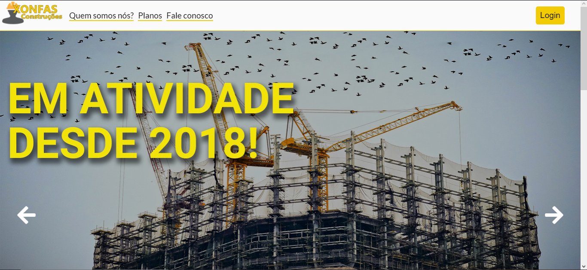
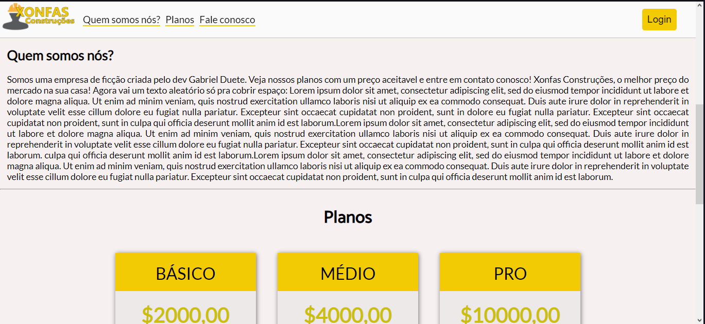

<h1 align='center'>
    Xonfas Construções
</h1>

# 🤔 Sobre

O projeto **Xonfas Construções** é um site  responsivo de loja de construções. Desenvolvido com HTML5, CSS3-FlexBox e um pouco de JavaScript para a construção do carrossel/slide de imagens.

## 💻Tecnologias utilizadas

- [HTML5](https://developer.mozilla.org/pt-BR/docs/Web/HTML/HTML5)
- [CSS3](https://www.w3.org/Style/CSS/Overview.en.html)

# 😮 Preview

<h2>
        
        
        
        
        
</h2>
